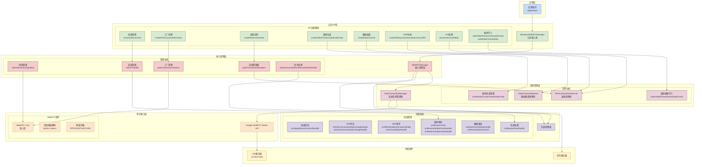

# Windows-WebRTC-SDK-version

## SDK 概述

Windows WebRTC SDK 是一个高度封装的多媒体通信框架，提供了完整的 WebRTC 功能实现，包括音视频传输、数据通道和自定义信令交互。该 SDK 采用分层设计，隐藏了复杂的 WebRTC 原生接口，为开发者提供了简洁易用的 C++ API。

## 核心特性

### 1. 多实例管理
- 支持多个 PeerConnectionFactory 实例
- 支持多个 PeerConnection 连接实例
- 支持多个媒体轨道（视频/音频）
- 支持多个 DataChannel 数据通道

### 2. 媒体处理能力
- 视频轨道创建与自定义视频源注入
- 音频轨道创建与自定义音频源注入
- 支持多种视频编解码器
- 精确的媒体同步控制

### 3. 数据传输
- 可靠有序的 DataChannel 数据传输
- 二进制数据收发支持
- 实时事件传输（鼠标、键盘等）

### 4. 完整的信令交互
- SDP 协商（Offer/Answer）
- ICE Candidate 交换
- WebSocket 信令服务器连接

### 5. 丰富的回调系统
- 信令服务器连接状态通知
- 远程媒体轨道接收通知
- 视频/音频帧接收回调
- PeerConnection 状态变化通知
- ICE 连接状态变化通知
- DataChannel 数据接收回调

## 架构设计

SDK 采用清晰的分层架构设计，各层职责分明：

1. **应用层** - 用户应用程序
2. **公共API层** - WindowsWebRTCManager 提供统一接口
3. **核心管理层** - WebRTCManager 协调管理所有实例
4. **连接管理层** - PeerConnectionManager 管理单个连接
5. **原生接口层** - Google WebRTC Native API

## 主要组件

### WindowsWebRTCManager（公共API）
这是 SDK 的主要入口点，提供所有对外接口：
- 连接管理（connect, disconnect）
- 资源创建（createPeerConnectionFactory, createPeerConnection）
- 媒体轨道管理（createVideoTrack, createAudioTrack）
- 数据通道管理（createDataChannel）
- SDP 协商（createOffer, processAnswer, processOffer）
- ICE 处理（processIceCandidate）
- 媒体帧写入（writeVideoFrame, writeAudioFrame）
- 数据通道写入（writeDataChannelData）

### WebRTCManager（核心管理）
负责协调管理所有 WebRTC 实例和回调处理。

### PeerConnectionManager（连接管理）
管理单个 PeerConnection 实例及其相关资源。

### WebRTC SDK 架构图


```mermaid
graph TB
    subgraph "应用层"
        APP[应用程序<br/>Application]
    end
    
    subgraph "公共API层"
        WAPI[WindowsWebRTCManager<br/>公有接口类]
        
        subgraph "API功能模块"
            APIConnect[连接管理<br/>connect/disConnect]
            APIFactory[工厂创建<br/>createPeerConnectionFactory]
            APIPC[连接实例<br/>createPeerConnection]
            APITrack[媒体轨道<br/>createVideoTrack/createAudioTrack]
            APIData[数据通道<br/>createDataChannel]
            APISDP[SDP协商<br/>createOffer/processAnswer/processOffer]
            APIIce[ICE处理<br/>processIceCandidate]
            APIWrite[媒体写入<br/>writeVideoFrame/writeAudioFrame<br/>writeDataChannelData]
        end
    end
    
    subgraph "核心管理层"
        CORE[WebRTCManager<br/>核心管理器]
        
        subgraph "管理功能"
            MThread[线程管理<br/>network/worker/signaling]
            MFactory[工厂管理<br/>peerConnectionFactorys]
            MPC[连接管理器<br/>peerConnectionManagers]
            MCallback[回调管理<br/>setOn*Handle]
            MSignal[信令处理<br/>webrtcAsyncWrite/onReceiveDataHandle]
        end
    end
    
    subgraph "连接管理层"
        PCM[PeerConnectionManager<br/>连接实例管理器]
        
        subgraph "实例功能"
            PCObserver[PeerConnectionObserver<br/>连接观察者]
            DCObserver[DataChannelObserver<br/>数据通道观察者]
            PCTrack[媒体轨道管理<br/>createVideoTrack/createAudioTrack]
            PCWrite[媒体数据写入<br/>writerVideoFrame/writerAudioFrame]
        end
    end
    
    subgraph "原生接口层"
        NATIVE[Google WebRTC Native API]
        
        subgraph "WebRTC组件"
            WEBRTC[WebRTC Core<br/>核心库]
            MEDIA[音视频编解码<br/>Builtin Codecs]
            NETWORK[网络传输<br/>RTP/ICE/STUN/TURN]
        end
    end
    
    subgraph "回调系统"
        CB[回调处理器]
        
        subgraph "回调类型"
            CBConnect[连接状态<br/>onSignalServerConnectHandle]
            CBP2P[P2P状态<br/>onPeerConnectionStateChangeHandle<br/>onIceConnectionStateChangeHandle]
            CBSDP[SDP事件<br/>onOfferHandle/onAnswerHandle<br/>onIceCandidateHandle]
            CBTrack[媒体接收<br/>onReceiveTrack<br/>onReceiveVideoFrameHandle<br/>onReceiveAudioFrameHandle]
            CBData[数据通道<br/>onDataChannelDataHandle<br/>onReceiveDataChannel]
            CBMsg[消息处理<br/>onReceiveDataHandle]
        end
    end
    
    subgraph "外部组件"
        SIGNAL[信令服务器]
        STUNTURN[ICE服务器<br/>STUN/TURN]
    end
    
    %% 主流程
    APP --> WAPI
    WAPI --> CORE
    CORE --> PCM
    PCM --> NATIVE
    
    %% 外部连接
    CORE --> SIGNAL
    NATIVE --> STUNTURN
    
    %% 回调连接
    PCM --> CB
    CORE --> CB
    
    %% 内部关联
    APIConnect --> MCallback
    APIFactory --> MFactory
    APIPC --> MPC
    APITrack --> PCTrack
    APIData --> DCObserver
    APISDP --> PCObserver
    APIIce --> PCObserver
    APIWrite --> PCWrite
    
    %% 功能关联
    MThread --> WEBRTC
    MFactory --> WEBRTC
    MPC --> PCObserver
    MCallback --> CBTrack
    MSignal --> CBMsg
    
    %% 样式优化
    classDef app fill:#c9daf8,stroke:#1155cc
    classDef api fill:#d9ead3,stroke:#38761d
    classDef core fill:#f4cccc,stroke:#990000
    classDef pc fill:#ead1dc,stroke:#741b47
    classDef native fill:#fce5cd,stroke:#e69138
    classDef callback fill:#d9d2e9,stroke:#351c75
    classDef external fill:#fff2cc,stroke:#bf9000
    
    class APP app
    class WAPI,APIConnect,APIFactory,APIPC,APITrack,APIData,APISDP,APIIce,APIWrite api
    class CORE,MThread,MFactory,MPC,MCallback,MSignal core
    class PCM,PCObserver,DCObserver,PCTrack,PCWrite pc
    class NATIVE,WEBRTC,MEDIA,NETWORK native
    class CB,CBConnect,CBP2P,CBSDP,CBTrack,CBData,CBMsg callback
    class SIGNAL,STUNTURN external
```

### Example Code

```cpp
#define HOPE_RTC_CONTROLLER
#undef WIN32_LEAN_AND_MEAN

#include "WindowsWebRTCManager.h"
#include "WebRTCVideoFrame.h"
#include <mmsystem.h>
#pragma comment(lib, "winmm.lib")

#include <iostream>
#include <boost/asio.hpp>
#include <boost/json.hpp>


#include "HWebRTC.h"

#include "Utils.h"

#include "E:\cppPro\WindowsCaptureDemo-version\WindowsCaptureDemo\MP3AudioReader.h"

std::string peerConnectionFactoryId;

std::string peerConnectionId;

std::string videoTrackId;

std::string audioTrackId;

std::string dataChannelId;

auto mp3AudioReader = std::make_shared<MP3AudioReader>();

int main()
{

    boost::asio::io_context ioContext;

    std::unique_ptr<boost::asio::executor_work_guard<boost::asio::io_context::executor_type>> ioContextWorkPtr = std::make_unique<boost::asio::executor_work_guard<boost::asio::io_context::executor_type>>(boost::asio::make_work_guard(ioContext));

    std::shared_ptr<hope::rtc::WindowsWebRTCManager> webrtcManager = std::make_shared<hope::rtc::WindowsWebRTCManager>();

    std::weak_ptr<hope::rtc::WindowsWebRTCManager> weakMgr = webrtcManager;

    webrtcManager->setOnSignalServerConnectHandle([weakMgr]() {
        
        if (auto mgr = weakMgr.lock()) {

            LOG_INFO("Signal server connected");

            boost::json::object jsonObject;

            jsonObject["requestType"] = 0;

			jsonObject["accountId"] = mgr->getAccountId();

			mgr->webrtcAsyncWrite(boost::json::serialize(jsonObject).c_str());
        }

        });

    webrtcManager->setOnOfferHandle([weakMgr](std::string peerConnectionId, std::string sdp) {
        
        if (auto mgr = weakMgr.lock()) {
        
            boost::json::object jsonObject;

            jsonObject["requestType"] = 1;

            jsonObject["accountId"] = mgr->getAccountId();

            jsonObject["targetId"] = mgr->getTargetId();

            jsonObject["sdp"] = sdp;

            jsonObject["type"] = "offer";

            mgr->webrtcAsyncWrite(boost::json::serialize(jsonObject).c_str());

        }

        });

    webrtcManager->setOnAnswerHandle([weakMgr](std::string peerConnectionId, std::string sdp) {

        if (auto mgr = weakMgr.lock()) {

            boost::json::object jsonObject;

            jsonObject["requestType"] = 1;

            jsonObject["accountId"] = mgr->getAccountId();

            jsonObject["targetId"] = mgr->getTargetId();

            jsonObject["sdp"] = sdp;

            jsonObject["type"] = "answer";

            mgr->webrtcAsyncWrite(boost::json::serialize(jsonObject).c_str());

        }

        });

    webrtcManager->setOnIceCandidateHandle([weakMgr](std::string peerConnectionId,std::string candidate,std::string mid,int mlineIndex) {
        
        if (auto mgr = weakMgr.lock()) {

            boost::json::object jsonObject;

            jsonObject["requestType"] = 1;

            jsonObject["accountId"] = mgr->getAccountId();

            jsonObject["targetId"] = mgr->getTargetId();

            jsonObject["type"] = "candidate";

            jsonObject["candidate"] = candidate;

            jsonObject["mid"] = mid;

            jsonObject["mlineIndex"] = mlineIndex;

            mgr->webrtcAsyncWrite(boost::json::serialize(jsonObject).c_str());
        }

		});

    webrtcManager->setOnReceiveTrack([weakMgr](std::string peerConnectionId, std::string trackId, int trackType) {
        LOG_INFO("Received remote track: PeerConnectionId=%s, TrackId=%s, TrackType=%d",
            peerConnectionId.c_str(), trackId.c_str(), trackType);
		});

    webrtcManager->setOnReceiveVideoFrameHandle([weakMgr](std::string peerConnectionId,std::string videoTrackId, hope::rtc::WebRTCVideoFrame webrtcVideoFrame) {
            
			static bool firstFrame = true;

            if (firstFrame) {

                LOG_INFO("PeerConnection[%s] received VideoTrack[%s] VideoFrame", peerConnectionId.c_str(), videoTrackId.c_str());

				firstFrame = false;

            }

        });

    webrtcManager->setOnReceiveAudioFrameHandle([weakMgr](std::string peerConnectionId, std::string audioTrackId, const void* pcmData, int bitsPerSample, int sampleRate, size_t numberOfChannels, size_t numberOfFrames) {
        static bool firstFrame = true;
        if (firstFrame) {
            LOG_INFO("PeerConnection[%s] received AudioTrack[%s] AudioFrame: %dHz, %d channels, %d frames",
                peerConnectionId.c_str(), audioTrackId.c_str(), sampleRate, numberOfChannels, numberOfFrames);
            firstFrame = false;
        }
		});

    webrtcManager->setOnPeerConnectionStateChangeHandle([weakMgr](std::string peerConnectionId, int type) {
        static const char* stateNames[] = {
            "New", "Connecting", "Connected", "Disconnected", "Failed", "Closed"
        };

        const char* name = (type >= 0 && type < 6) ? stateNames[type] : "Unknown";
        LOG_INFO("PeerConnection[%s] PeerConnection state: %s", peerConnectionId.c_str(), name);
        });

    webrtcManager->setOnIceConnectionStateChangeHandle([weakMgr](std::string peerConnectionId, int type) {
        static const char* stateNames[] = {
            "New",
            "Checking",
            "Connected",
            "Completed",
            "Failed",
            "Disconnected",
            "Closed",
            "Max"
        };

        const char* stateName = (type >= 0 && type < 8) ? stateNames[type] : "Unknown";
        LOG_INFO("PeerConnection[%s] ICE state changed to: %s", peerConnectionId.c_str(), stateName);

        if (type == IceConnectionState::kIceConnectionDisconnected) {
        
            LOG_INFO("PeerConnection[%s] ICE disconnected, releasing PeerConnection", peerConnectionId.c_str());
            if (auto mgr = weakMgr.lock()) {
                mgr->releasePeerConnection(peerConnectionId.c_str());
			}

        }
        else if (type == IceConnectionState::kIceConnectionConnected) {
        
            LOG_INFO("ICE Connected! Starting Audio Broadcast Thread...");

            std::thread audioThread([weakMgr, peerConnectionId]() {
                auto mgr = weakMgr.lock();
                if (!mgr) return;

                timeBeginPeriod(1);

                while (true) {
                    mp3AudioReader->Initialize(L"E:\\cppPro\\WindowsCaptureDemo-version\\qsx.mp3");

                    auto next_frame_time = std::chrono::steady_clock::now();

                    while (!mp3AudioReader->IsEndOfFile()) {
                        MP3AudioReader::AudioFrame frame;

                        HRESULT hr = mp3AudioReader->ReadOpusFrame(frame, MP3AudioReader::OPUS_FRAME_10MS);
                        if (hr == S_FALSE) break;

                        if (SUCCEEDED(hr)) {
                            mgr->writeAudioFrame(peerConnectionId.c_str(),
                                audioTrackId.c_str(),
                                reinterpret_cast<unsigned char*>(frame.data.data()),
                                16,     
                                48000, 
                                2,        
                                frame.sampleCount 
                            );
                        }

  
                        next_frame_time += std::chrono::milliseconds(10);
                        std::this_thread::sleep_until(next_frame_time);


                        if (std::chrono::steady_clock::now() > next_frame_time + std::chrono::milliseconds(50)) {
                            next_frame_time = std::chrono::steady_clock::now();
                        }
                    }

                    LOG_INFO("Audio track finished, restarting...");
                    std::this_thread::sleep_for(std::chrono::milliseconds(500));
                }

                timeEndPeriod(1);
                LOG_INFO("Audio thread exited.");
                });

            audioThread.detach();

        }

        });

    webrtcManager->setOnDataChannelDataHandle([weakMgr](std::string peerConnectionId, std::string dataChannelId, const unsigned char* data, size_t size) {
        if (size < sizeof(short)) return;

        // 获取事件类型
        short eventType = *reinterpret_cast<const short*>(data);

        switch (eventType) {
        case 0: { // 鼠标移动
            if (size >= 10) { // short(2) + uint32(4) + uint32(4)
                uint32_t x = *reinterpret_cast<const uint32_t*>(data + 2);
                uint32_t y = *reinterpret_cast<const uint32_t*>(data + 6);
                LOG_INFO("[Mouse Move] X: %u, Y: %u", x, y);
            }
            break;
        }
        case 1:   // 鼠标按下
        case 2: { // 鼠标抬起
            if (size >= 12) { // short*2 + int*2
                short mouseButton = *reinterpret_cast<const short*>(data + 2);
                int rawX = *reinterpret_cast<const int*>(data + 4);
                int rawY = *reinterpret_cast<const int*>(data + 8);
                LOG_INFO("[Mouse %s] Button: %d, RawPos: (%d, %d)",
                    (eventType == 1 ? "Down" : "Up"), mouseButton, rawX, rawY);
            }
            break;
        }
        case 3:   // 键盘按下
        case 4: { // 键盘抬起
            if (size >= 4) { // short(2) + byte(1) + byte(1)
                unsigned char keyCode = data[2];
                unsigned char keyFlags = data[3];
                LOG_INFO("[Key %s] Code: %u, Flags: %u",
                    (eventType == 3 ? "Down" : "Up"), keyCode, keyFlags);
            }
            break;
        }
        case 5: { // 鼠标滚轮
            if (size >= 6) { // short(2) + int(4)
                int delta = *reinterpret_cast<const int*>(data + 2);
                LOG_INFO("[Mouse Wheel] Delta: %d", delta);
            }
            break;
        }
        default:
            LOG_INFO("[Unknown Event] Type: %d, Size: %zu", eventType, size);
            break;
        }
        });

    webrtcManager->setOnReceiveDataHandle([weakMgr](std::string data) {
       
        boost::json::object json =  boost::json::parse(data).as_object();

        if (json["requestType"].as_int64() == 1) {
        
            if (auto mgr = weakMgr.lock()) {

                if (json.contains("webRTCRemoteState")) {

                    mgr->setTargetId(json["accountId"].as_string().c_str());
                
                    mgr->createOffer(peerConnectionId.c_str());

                }
                else if (json.contains("type")) {
                
                    if (json["type"].as_string() == "offer") {
                    
                        mgr->processOffer(peerConnectionId.c_str(), json["sdp"].as_string().c_str());

                    }
                    else if (json["type"].as_string() == "answer") {
                    
                        mgr->processAnswer(peerConnectionId.c_str(), json["sdp"].as_string().c_str());

                    }
                    else if (json["type"].as_string() == "candidate") {

                        std::string candidate(json["candidate"].as_string().c_str());
                        std::string mid = json.contains("mid") ? std::string(json["mid"].as_string().c_str()) : "";
                        int mlineIndex = json.contains("mlineIndex") ? static_cast<int>(json["mlineIndex"].as_int64()) : 0;
                    
                        mgr->processIceCandidate(peerConnectionId.c_str(), candidate.c_str(), mid.c_str(),mlineIndex);

                    }

                }

            }

        }else if (json["requestType"].as_int64() == 0) {

            if (json["state"].as_int64() == 200) {
            
                if (auto mgr = weakMgr.lock()) {
                
                    peerConnectionFactoryId =   mgr->createPeerConnectionFactory(false);

                    if (!peerConnectionFactoryId.empty()) {
                    
                        peerConnectionId = mgr->createPeerConnection(peerConnectionFactoryId.c_str());

                        if (!peerConnectionId.empty()) {
                        
                            LOG_INFO("createPeerConnection Successful");

#ifdef HOPE_RTC_CONTROLLER  

							dataChannelId = mgr->createDataChannel(peerConnectionId.c_str(), "dataChannel");

                            if (!dataChannelId.empty()) {
                            
								LOG_INFO("createDataChannel Successful");

                            }


							audioTrackId = mgr->createAudioTrack(peerConnectionId.c_str(), "audioTrack");

                            if (!audioTrackId.empty()) {

                                LOG_INFO("createAudioTrack Successful");

                            }

#else

                            boost::json::object json;

                            json["requestType"] = 1;

                            json["webRTCRemoteState"] = 1;

                            json["accountId"] = mgr->getAccountId();

                            json["targetId"] = mgr->getTargetId();

                            json["webrtcAudioEnable"] = 1;

                            mgr->webrtcAsyncWrite(boost::json::serialize(json).c_str());
#endif

                        }
                    
                    }

                }

            }

        }

        });

    webrtcManager->addStunServer("");

    webrtcManager->addTurnServer("", "", "");

    webrtcManager->setAccountId("");

    webrtcManager->setTargetId("");

    webrtcManager->connect("");

    ioContext.run();

    return 0;
}

```

### ZLMediaKit Example Code 

```cpp
#define HOPE_RTC_PUSH

#include "mainwindow.h"
#include "ui_mainwindow.h"
#include <QApplication>

#include <boost/json.hpp>

#include "Utils.h"

#include <QMediaCaptureSession>
#include <QScreenCapture>
#include <QVideoFrame>
#include <QVideoSink>

MainWindow::MainWindow(QWidget* parent)
    : QMainWindow(parent)
    , ui(new Ui::MainWindow)
    , webrtcManager(nullptr)
{
    ui->setupUi(this);

    ioContextWorkPtr = std::make_unique<boost::asio::executor_work_guard<boost::asio::io_context::executor_type>>(boost::asio::make_work_guard(ioContext));

    ioContextThread = std::thread([this](){

        ioContext.run();

    });

    webrtcManager = std::make_shared<hope::rtc::WindowsWebRTCManager>();

    webrtcManager->setOnPeerConnectionStateChangeHandle([this](std::string peerConnectionId, int type) {
        static const char* stateNames[] = {
            "New", "Connecting", "Connected", "Disconnected", "Failed", "Closed"
        };

        const char* name = (type >= 0 && type < 6) ? stateNames[type] : "Unknown";
        LOG_INFO("PeerConnection[%s] PeerConnection state: %s", peerConnectionId.c_str(), name);

    });

    webrtcManager->setOnIceConnectionStateChangeHandle([this](std::string peerConnectionId, int type){

        if(type == static_cast<int>(IceConnectionState::kIceConnectionConnected)){

#ifdef HOPE_RTC_PUSH

            QMetaObject::invokeMethod(this, [this]() {
                QScreenCapture *screenCapture = new QScreenCapture(this);
                // 选择屏幕（若有多个）
                screenCapture->setScreen(QGuiApplication::primaryScreen());

                // 2. 创建会话
                QMediaCaptureSession * session = new QMediaCaptureSession(this);
                session->setScreenCapture(screenCapture);

                // 3. 获取视频帧（直接接入你的 WebRTC SDK）
                QVideoSink *sink = new QVideoSink(this);
                session->setVideoOutput(sink);

                screenCapture->start();

                connect(sink, &QVideoSink::videoFrameChanged, this, [this](const QVideoFrame &frame) {
                    // 将 QVideoFrame 转换为你的 WebRTC 需要的 I420 格式
                    if (!frame.isValid()) return;

                    QVideoFrame cloneFrame(frame);
                    cloneFrame.map(QVideoFrame::ReadOnly);

                    QVideoFrameFormat format = cloneFrame.surfaceFormat();
                    int width = format.frameWidth();
                    int height = format.frameHeight();
                    QVideoFrameFormat::PixelFormat pixelFormat = format.pixelFormat();

                    // 准备存储转换后的 I420 数据
                    int y_size = width * height;
                    int uv_size = y_size / 4;
                    size_t i420_size = y_size + uv_size * 2;  // Y + U + V
                    std::vector<uint8_t> i420_buffer(i420_size);
                    uint8_t *y_plane = i420_buffer.data();
                    uint8_t *u_plane = y_plane + y_size;
                    uint8_t *v_plane = u_plane + uv_size;

                    bool converted = false;

                    // 情况1：已经是 I420 或 YUV420P（Qt 中常用 Format_YUV420P）
                    if (pixelFormat == QVideoFrameFormat::Format_YUV420P) {
                        const uint8_t *src_y = cloneFrame.bits(0);
                        const uint8_t *src_u = cloneFrame.bits(1);
                        const uint8_t *src_v = cloneFrame.bits(2);
                        int stride_y = cloneFrame.bytesPerLine(0);
                        int stride_u = cloneFrame.bytesPerLine(1);
                        int stride_v = cloneFrame.bytesPerLine(2);

                        // 逐行复制，去除可能的 stride 填充
                        for (int row = 0; row < height; ++row) {
                            memcpy(y_plane + row * width, src_y + row * stride_y, width);
                        }
                        for (int row = 0; row < height/2; ++row) {
                            memcpy(u_plane + row * width/2, src_u + row * stride_u, width/2);
                            memcpy(v_plane + row * width/2, src_v + row * stride_v, width/2);
                        }
                        converted = true;
                    }
                    // 情况2：NV12（Format_NV12） -> 转换为 I420
                    else if (pixelFormat == QVideoFrameFormat::Format_NV12) {
                        const uint8_t *src_y = cloneFrame.bits(0);
                        const uint8_t *src_uv = cloneFrame.bits(1);
                        int stride_y = cloneFrame.bytesPerLine(0);
                        int stride_uv = cloneFrame.bytesPerLine(1);

                        // 复制 Y 平面
                        for (int row = 0; row < height; ++row) {
                            memcpy(y_plane + row * width, src_y + row * stride_y, width);
                        }
                        // 分离 UV -> U/V
                        for (int row = 0; row < height/2; ++row) {
                            for (int col = 0; col < width/2; ++col) {
                                u_plane[row * (width/2) + col] = src_uv[row * stride_uv + col*2];
                                v_plane[row * (width/2) + col] = src_uv[row * stride_uv + col*2 + 1];
                            }
                        }
                        converted = true;
                    }else if (pixelFormat == QVideoFrameFormat::Format_BGRA8888) {
                        const uint8_t *src = cloneFrame.bits(0);
                        int stride = cloneFrame.bytesPerLine(0);

                        for (int y = 0; y < height; ++y) {
                            const uint8_t* row_src = src + y * stride;
                            uint8_t* row_y = y_plane + y * width;

                            uint8_t* row_u = u_plane + (y / 2) * (width / 2);
                            uint8_t* row_v = v_plane + (y / 2) * (width / 2);

                            for (int x = 0; x < width; ++x) {
                                // BGRA8888 在内存中的顺序是 B, G, R, A
                                uint8_t B = row_src[x * 4 + 0];
                                uint8_t G = row_src[x * 4 + 1];
                                uint8_t R = row_src[x * 4 + 2];
                                // uint8_t A = row_src[x * 4 + 3]; // Alpha 通道直接忽略

                                // 计算 Y (亮度)
                                row_y[x] = ((66 * R + 129 * G + 25 * B + 128) >> 8) + 16;

                                // 每 2x2 个像素采一次 U 和 V (4:2:0 采样)
                                if (y % 2 == 0 && x % 2 == 0) {
                                    row_u[x / 2] = ((-38 * R - 74 * G + 112 * B + 128) >> 8) + 128;
                                    row_v[x / 2] = ((112 * R - 94 * G - 18 * B + 128) >> 8) + 128;
                                }
                            }
                        }
                        converted = true;
                    }else if (pixelFormat == QVideoFrameFormat::Format_BGRA8888) {
                        const uint8_t *src = cloneFrame.bits(0);
                        int stride = cloneFrame.bytesPerLine(0);

                        for (int y = 0; y < height; ++y) {
                            // 定位到当前行的起始位置
                            const uint8_t* row_src = src + y * stride;
                            uint8_t* row_y = y_plane + y * width;

                            // UV 平面的行指针 (U和V的宽高都是Y的一半)
                            uint8_t* row_u = u_plane + (y / 2) * (width / 2);
                            uint8_t* row_v = v_plane + (y / 2) * (width / 2);

                            for (int x = 0; x < width; ++x) {
                                // 小端模式下，XRGB8888 在内存中的顺序是 B, G, R, X
                                uint8_t B = row_src[x * 4 + 0];
                                uint8_t G = row_src[x * 4 + 1];
                                uint8_t R = row_src[x * 4 + 2];

                                // 计算 Y
                                row_y[x] = ((66 * R + 129 * G + 25 * B + 128) >> 8) + 16;

                                // 每 2x2 个像素采一次 U 和 V (4:2:0 的精髓)
                                if (y % 2 == 0 && x % 2 == 0) {
                                    row_u[x / 2] = ((-38 * R - 74 * G + 112 * B + 128) >> 8) + 128;
                                    row_v[x / 2] = ((112 * R - 94 * G - 18 * B + 128) >> 8) + 128;
                                }
                            }
                        }
                        converted = true;
                    }
                    // 其他格式可加转换（如 Format_YUYV 等），暂时跳过或做软件转换
                    else {
                        LOG_INFO("Unsupported pixel format for direct push:%d" , pixelFormat);
                        qWarning() << "Unsupported pixel format for direct push:" << pixelFormat;
                        cloneFrame.unmap();
                        return;
                    }

                    webrtcManager->writeVideoFrame(this->peerConnectionId.c_str(),videoTrackId.c_str(), i420_buffer.data(), i420_buffer.size(),
                                                   width, height);

                    cloneFrame.unmap();
                });

            });

#else

#endif

        }

    });

    webrtcManager->setOnReceiveTrack([this](std::string peerConnectionId,std::string trackId,int trackType){

        LOG_INFO("Received remote track: PeerConnectionId=%s, TrackId=%s, TrackType=%d",
                 peerConnectionId.c_str(), trackId.c_str(), trackType);

        if(trackType == static_cast<int>(WebRTCTrackType::video)){

            videoTrackId = trackId;

        }else if(trackType == static_cast<int>(WebRTCTrackType::audio)){

            audioTrackId = trackId;

        }

    });

    webrtcManager->setOnReceiveDataChannel([this](std::string peerConnectionId,std::string dataChannelId){

        LOG_INFO("Received remote DataChannel: PeerConnectionId=%s, DataChannel=%s",
                 peerConnectionId.c_str(), dataChannelId.c_str());

        this->dataChannelId = dataChannelId;

    });

    webrtcManager->setOnOfferHandle([this](std::string peerConnectionId, std::string sdp) {

        boost::asio::co_spawn(ioContext,
                              [this, sdp, peerConnectionId]() -> boost::asio::awaitable<void> {
                                  try {
                                      // 1. 定义连接参数
                                      std::string host = "61.153.18.148";
                                      // 【修改点】：端口改为 HTTP 默认的 80
                                      std::string port = "80";

#ifdef HOPE_RTC_PUSH

                                       std::string target = "/index/api/webrtc?app=live&stream=test&type=push";

#else

                                        std::string target = "/index/api/webrtc?app=live&stream=test&type=play";

#endif

                                      // 获取当前协程的执行器 (必须从协程内部获取 executor 传给 stream 和 resolver)
                                      auto executor = co_await boost::asio::this_coro::executor;
                                      boost::asio::ip::tcp::resolver resolver(executor);

                                      // 【修改点】：移除 ssl_context，使用普通的 tcp_stream
                                      boost::beast::tcp_stream stream(executor);

                                      // --- 开始全异步操作 ---
                                      // 异步 DNS 解析
                                      auto const results = co_await resolver.async_resolve(host, port, boost::asio::use_awaitable);

                                      // 【修改点】：直接建立 TCP 连接，移除 SSL 握手和 SNI 设置
                                      co_await stream.async_connect(results, boost::asio::use_awaitable);

                                      // 构造 HTTP POST 请求
                                      boost::beast::http::request<boost::beast::http::string_body> req{boost::beast::http::verb::post, target, 11};
                                      req.set(boost::beast::http::field::host, host);
                                      req.set(boost::beast::http::field::user_agent, "Beast-WebRTC-Client-Coroutine");
                                      req.set(boost::beast::http::field::content_type, "text/plain");
                                      req.body() = sdp;
                                      req.prepare_payload();

                                      // 异步发送请求
                                      co_await boost::beast::http::async_write(stream, req, boost::asio::use_awaitable);

                                      // 异步接收响应
                                      boost::beast::flat_buffer buffer;
                                      boost::beast::http::response<boost::beast::http::string_body> res;
                                      co_await boost::beast::http::async_read(stream, buffer, res, boost::asio::use_awaitable);

                                      // 【修改点】：优雅关闭普通的 TCP socket (替换掉 async_shutdown)
                                      boost::system::error_code shutdown_ec;
                                      stream.socket().shutdown(boost::asio::ip::tcp::socket::shutdown_both, shutdown_ec);
                                      stream.close();

                                      // --- 解析 JSON 数据 ---
                                      if (res.result() == boost::beast::http::status::ok) {

                                          boost::system::error_code json_ec;

                                          boost::json::value jv = boost::json::parse(res.body(), json_ec);

                                          if (!json_ec && jv.is_object()) {
                                              auto& obj = jv.get_object();
                                              if (obj.contains("code") && obj.at("code").as_int64() == 0) {
                                                  std::string answerSdp = obj.at("sdp").as_string().c_str();
                                                  // 【替换输出】：使用 LOG_INFO 打印成功信息
                                                  LOG_INFO("✓ 成功获取 ZLM Answer SDP! (协程模式)\n");
                                                  this->webrtcManager->processAnswer(peerConnectionId.c_str(), answerSdp.c_str());

                                              } else {
                                                  // 【替换输出】：提取 msg 字段并用 %s 格式化打印
                                                  LOG_INFO("✗ ZLM 业务报错: %s\n", obj.at("msg").as_string().c_str());
                                              }
                                          } else {
                                              LOG_INFO("✗ 解析 JSON 响应失败\n");
                                          }
                                      } else {
                                          // 【替换输出】：提取状态码用 %d 格式化打印
                                          LOG_INFO("✗ HTTP 请求失败，状态码: %d\n", res.result_int());
                                      }

                                  } catch(std::exception const& e) {
                                      // 【替换输出】：捕获异常并用 %s 格式化打印
                                      LOG_INFO("✗ 协程内部发生异常: %s\n", e.what());
                                  }

                                  co_return; // 结束协程
                              },
                              boost::asio::detached);
    });

    webrtcManager->setOnReceiveVideoFrameHandle([this](std::string peerConnectionId, std::string videoTrackId,hope::rtc::WebRTCVideoFrame webrtcVideoFrame) {

        if(ui->widget){
            ui->widget->displayFrame(std::move(webrtcVideoFrame));
        }
    });

    webrtcManager->setOnReceiveAudioFrameHandle([this](std::string peerConnectionId, std::string audioTrackId, const void* pcmData, int bitsPerSample, int sampleRate, size_t numberOfChannels, size_t numberOfFrames) {

        qint64 totalBytes = numberOfFrames * numberOfChannels * (bitsPerSample / 8);

        while (audioSink->bytesFree() < totalBytes) {
            std::this_thread::sleep_for(std::chrono::milliseconds(5)); // 睡 5 毫秒再检查
        }

        if (this->audioDevice && this->audioDevice->isOpen()) {
            // 直接将 void* 强转为 const char* 并写入
            this->audioDevice->write(static_cast<const char*>(pcmData), totalBytes);
        }

    });


    webrtcManager->setOnIceCandidateHandle([this](std::string peerConnectionId,std::string candidate,std::string mid,int mlineIndex) {

        LOG_INFO("Received IceCandidate: PeerConnectionId=%s, candidate=%s, mid=%s, mlineIndex:%d",
                 peerConnectionId.c_str(),candidate.c_str(), mid.c_str(), mlineIndex);

    });


    QAudioFormat format;
    format.setSampleRate(48000);
    format.setChannelCount(2);
    format.setSampleFormat(QAudioFormat::Int16);

    audioSink = new QAudioSink(format);

    audioDevice = audioSink->start();

    webrtcManager->addStunServer("stun:202.101.189.30:13478");

    peerConnectionFactoryId = webrtcManager->createPeerConnectionFactory();

    LOG_INFO("createPeerConnectionFactory");

    if(!peerConnectionFactoryId.empty()){

        LOG_INFO("createPeerConnectionFactory successful");

        peerConnectionId = webrtcManager->createPeerConnection(peerConnectionFactoryId.c_str());

        LOG_INFO("createPeerConnection");

        if(!peerConnectionId.empty()){

            LOG_INFO("createPeerConnection successful");

#ifdef HOPE_RTC_PUSH

            videoTrackId = webrtcManager->createVideoTrack(peerConnectionId.c_str(),"videoTrack",WebRTCVideoCodec::H264,WebRTCVideoPreference::MAINTAIN_FRAMERATE);

            if(!videoTrackId.empty()) LOG_INFO("createVideoTrack successful");

            audioTrackId = webrtcManager->createAudioTrack(peerConnectionId.c_str(),"audioTrackId");

            if(!audioTrackId.empty()) LOG_INFO("createAudioTrack successful");

            webrtcManager->createOffer(peerConnectionId.c_str());

            LOG_INFO("createOffer");

#else

            webrtcManager->createOffer(peerConnectionId.c_str());

            LOG_INFO("createOffer");
#endif

        }

    }

}

MainWindow::~MainWindow()
{

}

```
